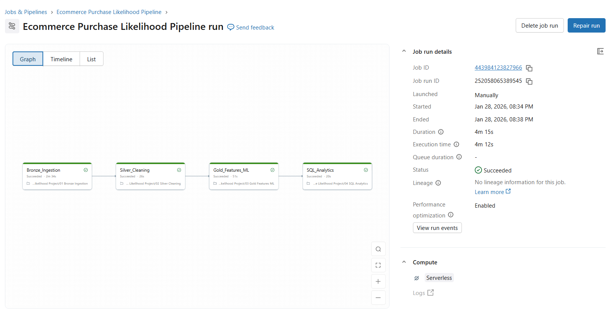
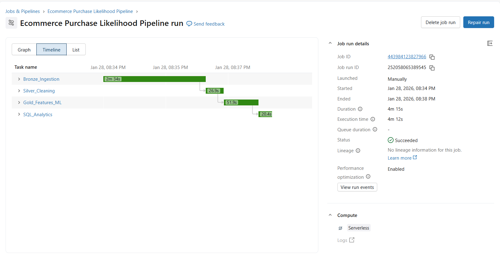

# Ecommerce-purchase-likelihood-databricks
End to end Databricks project using Medallion Architecture and ML flow to predict E commerce purchase likelihood.

## Project Overview

This project builds an end to end data and AI pipeline on Databricks to predict
purchase likelihood and help E commerce businesses prioritize high intent customers.

The solution demonstrates real world data engineering, machine learning,
analytics using Databricks, Delta Lake, MLflow and SQL.

## Problem Statement & AI Framing

E commerce platforms generate large volumes of user behavior data such as
product views, cart additions and purchases. However, only a small fraction
of users complete a purchase.

Rule based approaches fail to capture complex behavioral patterns.
This project uses machine learning to predict purchase likelihood,
enabling businesses to focus marketing and engagement efforts on high intent users.

## Dataset

- Source: E commerce behavior data from a multi category online store.
- Time period: November 2019.
- Type: Event level user behavior data.

Each record represents a user interaction such as a view, cart addition
or purchase, making it suitable for behavioral modeling.

## Architecture

The project follows a Medallion Architecture using Delta Lake:

Bronze → Silver → Gold

- Bronze: Raw event data ingestion.
- Silver: Cleaned and structured event data.
- Gold: Aggregated user level features for ML and analytics.

## Data Pipeline

### Bronze Layer
- Raw CSV data ingested into Delta tables.
- No transformations applied.

### Silver Layer
- Filtered relevant event types (view, cart, purchase).
- Standardized timestamps.
- Removed invalid records.

### Gold Layer
- Aggregated user level behavioral features.
- Created ML ready dataset.

## Machine Learning Approach

- ML Task: Binary Classification (Purchase Likelihood).
- Model: Logistic Regression (baseline, explainable).
- Features:
  - Total events
  - View count
  - Cart count
  - Purchase count
- Experiment tracking implemented using MLflow

## Business Insights (SQL Analytics)

SQL analytics were used to convert model outputs into actionable insights:

- Identification of high intent customers.
- Detection of users with high engagement but no purchase.
- Conversion rate estimation.
- Behavioral comparison between purchasers and non purchasers.
- 
Logistic Regression was chosen as a simple, interpretable baseline to establish a strong benchmark before exploring more complex models.

## Orchestration

The entire pipeline is orchestrated using Databricks Jobs with task dependencies:

Bronze → Silver → Gold → SQL Analytics

This ensures automated, repeatable and production-style execution.

## Key Results

- Successfully processed 67+ million raw events.
- Built an automated end to end pipeline.
- Trained and logged a purchase likelihood model.
- Generated business ready insights using SQL.

## Limitations & Future Work

- Model performance can be improved using advanced algorithms.
- Session level features could enhance prediction accuracy.
- Real time inference and dashboards can be added in future iterations.

